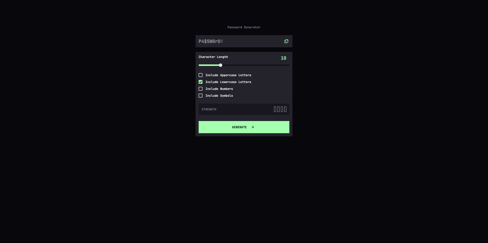

# Frontend Mentor - Password generator app solution

This is my solution to the [Password Generator App challenge on Frontend Mentor](https://www.frontendmentor.io/challenges/password-generator-app-Mr8CLycqjh).  
The challenge ended up being much more complex than it first appeared, which made it a great learning project.

## Table of contents

- [Overview](#overview)
  - [The challenge](#the-challenge)
  - [Screenshot](#screenshot)
  - [Links](#links)
- [My process](#my-process)
  - [Built with](#built-with)
  - [What I learned](#what-i-learned)
  - [Continued development](#continued-development)
  - [Useful resources](#useful-resources)
- [Author](#author)

## Overview

### The challenge

Users should be able to:

- Generate a password based on selected inclusion options  
- Copy the generated password to the clipboard  
- View a custom strength rating for their password  
- Experience a responsive layout across devices  
- See hover and active states for all interactive elements  

### Screenshot

### Links

- Solution URL: *coming soon*
- Live Site URL: (https://d0bbysocks.github.io/password_generator/)

## My process

### Built with

- Semantic HTML5  
- CSS custom properties  
- Flexbox  
- Mobile-first workflow  
- Vanilla JavaScript (custom password logic, scoring system, clipboard API)  

### What I learned

This project looked simple at first but quickly grew into something much bigger.  
The combination of:

- dynamic UI updates  
- custom range slider styling  
- masked SVG icons  
- a custom-built strength scoring system  
- state management  
- accessibility considerations  

…made the whole thing surprisingly advanced for a “small card”.

While working on it, I realized how **important notes, structure, and organization** are.  
My CSS started out structured, but as the project grew, I began adding things further down without grouping them properly.  
That’s something I absolutely want to improve in future projects.

JavaScript also ramped up in complexity, and I often needed to look things up.  
And that brings me to a question I had for more experienced developers:

### Continued development

Things I want to focus on in future projects:

- writing cleaner, more modular CSS  
- adding more meaningful comments  
- improving confidence in more advanced JS patterns  
- keeping a clearer overview as a project grows  

### Useful resources

- MDN Web Docs — for HTML/CSS/JS reference  
- StackOverflow — for specific syntax questions  
- Frontend Mentor community solutions — great for comparing approaches  

## Author

- Frontend Mentor — [D0bby](https://www.frontendmentor.io/profile/D0bbysocks)
